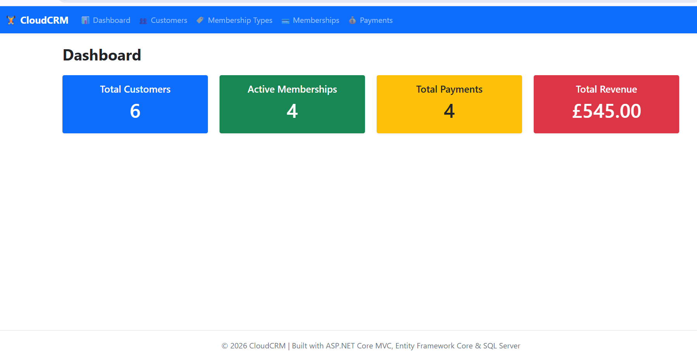
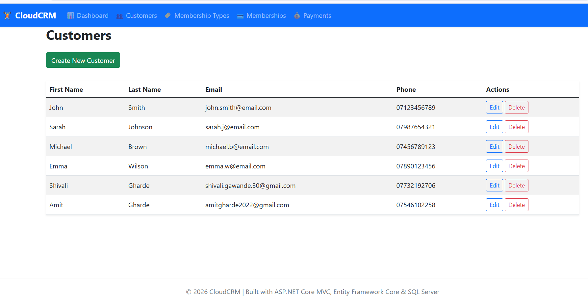
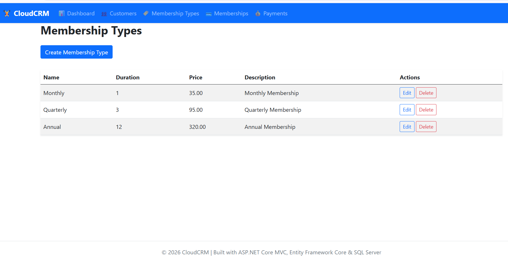
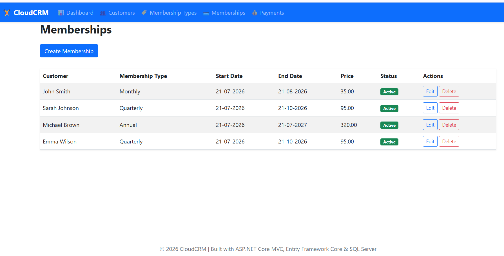
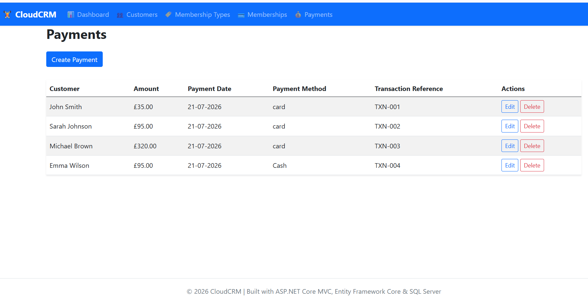

# CloudCRM

A modern CRM application built using ASP.NET Core MVC and Clean Architecture.

## Features

- Dashboard
- Customer Management
- Membership Management
- Membership Types
- Payment Tracking
- ASP.NET Core Identity Authentication
- Entity Framework Core
- SQL Server

## Technologies

- C#
- ASP.NET Core MVC
- Entity Framework Core
- SQL Server
- Bootstrap 5
- Clean Architecture
- Repository Pattern
- Dependency Injection

## Screenshots

### Dashboard

(Add screenshots here)

---

### Customers

---

### Membership Types

---

### Memberships

---

### Payments

---

## Installation

git clone ...

dotnet restore

dotnet ef database update

dotnet run