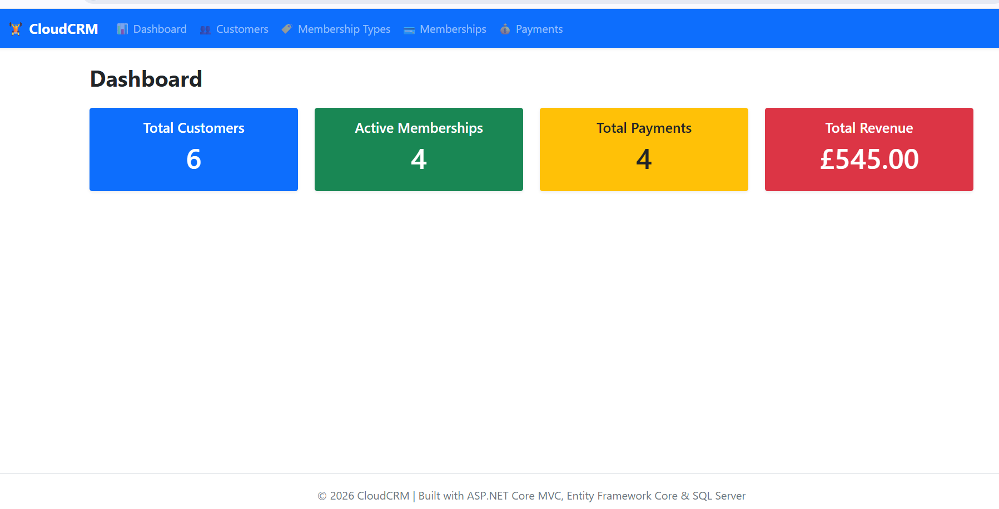
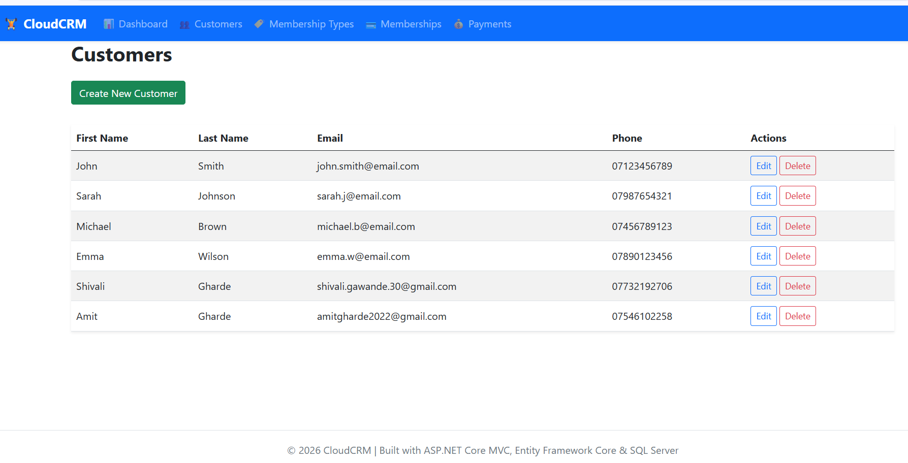
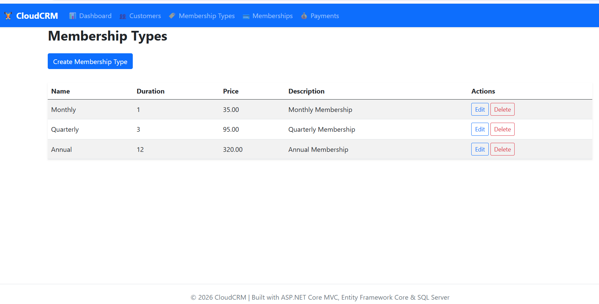
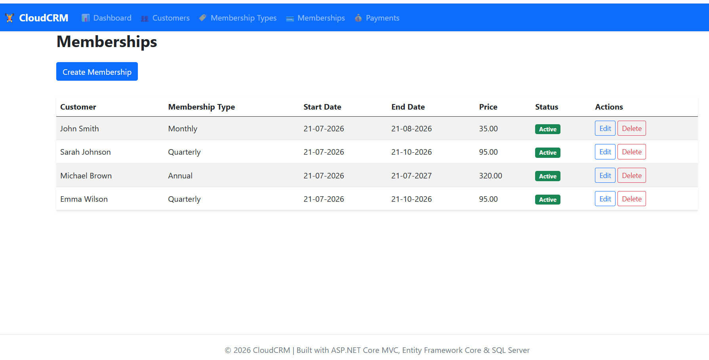
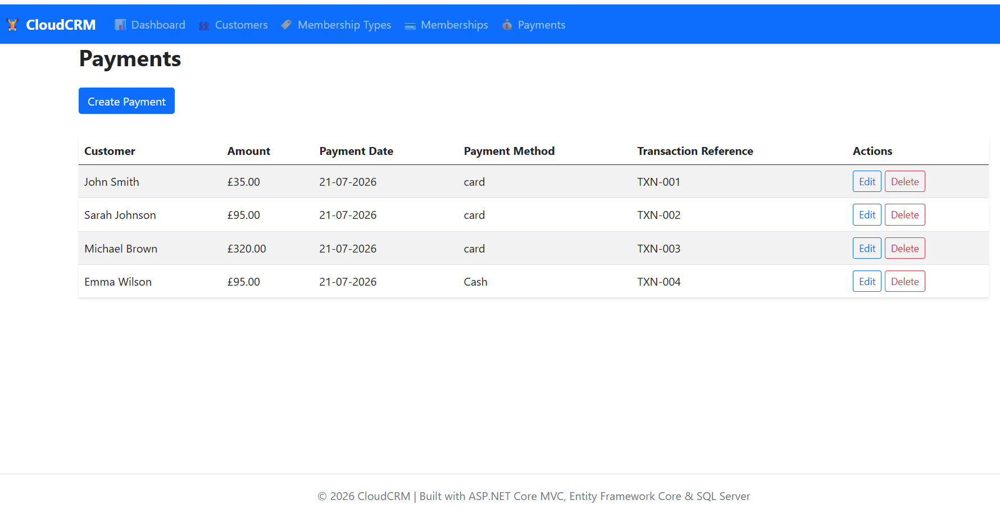

# CloudCRM

A modern CRM application built using ASP.NET Core MVC and Clean Architecture.

## Features

- Dashboard
- Customer Management
- Membership Management
- Membership Types
- Payment Tracking
- ASP.NET Core Identity Authentication
- Entity Framework Core
- SQL Server
- Role-based Authorization (Admin)

## Technologies

- C#
- ASP.NET Core MVC
- Entity Framework Core
- SQL Server
- Bootstrap 5
- Clean Architecture
- Repository Pattern
- Dependency Injection
- ASP.NET Core Identity

## Screenshots

### Dashboard



---

### Customers



---

### Membership Types



---

### Memberships



---

### Payments



---

## Security

- Custom login page
- ASP.NET Core Identity
- Seeded Admin role and user
- Role-based protection using `[Authorize(Roles = "Admin")]`

## Installation

```bash
git clone <your-repository-url>
cd CloudCRM-Clean

dotnet restore

dotnet ef database update \
  --project src/CloudCRM.Infrastructure \
  --startup-project src/CloudCRM.Web

dotnet run --project src/CloudCRM.Web
```